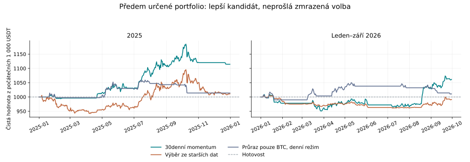

# ThetaBot: provedení obchodů a pomalé portfolio, 6. října 2026

**Spolehlivě ziskového bota pro živé obchodování tento experiment nepotvrdil.** Výrazně lepším průzkumným kandidátem je 30denní momentum na BTC, ETH a BNB. Varianta vybraná pouze podle starších dat ale na novějších obdobích neprošla. Lepší zpětně pozorované výsledky nejsou novým potvrzením výběru.

## Výsledek všech šesti předem určených variant

Každé období začíná s novými 1 000 USDT; historie signálů zůstává dostupná. Rok 2022 je zahřívací historie. Výběr podle čistého zisku proběhl na letech 2023–2024 při maximálním vývojovém propadu 15 %. Výběr byl zapsán před vyhodnocením 2025 a 2026.

| Varianta | Vývoj 2023–24 | Rok 2025 | Leden–září 2026 | Propad 2025 | Propad 2026 |
|---|---:|---:|---:|---:|---:|
| Průraz, pouze BTC | +31.25% | +1.40% | +1.07% | -4.27% | -3.81% |
| Průraz, tři aktiva | +15.47% | +8.50% | +0.65% | -4.52% | -3.89% |
| 30denní momentum, váhy podle volatility | +33.82% | +11.45% | +6.16% | -5.96% | -5.71% |
| Čtyři horizonty, stejné základní váhy | +34.97% | +1.11% | -0.88% | -8.12% | -4.36% |
| Čtyři horizonty, váhy podle volatility | +33.32% | +1.30% | -0.94% | -7.47% | -4.20% |
| 90denní rotace | +20.08% | +3.32% | -3.98% | -9.15% | -6.99% |

**Zmrazená volba: `horizons_equal`. Ekonomický screening: False. Živé nasazení: ne.**

| Kontrola zmrazené volby | Výsledek |
|---|---|
| development_eligible | prošlo |
| validation_positive | prošlo |
| transfer_positive | neprošlo |
| validation_drawdown | prošlo |
| transfer_drawdown | prošlo |
| cost_stress_positive | neprošlo |
| all_reset_quarters_positive | neprošlo |

Při dvojnásobném poplatku a skluzu: 2025: +0.81%; 2026: -1.13%.
Nezávisle resetovaná čtvrtletí 2025: -4.91%, +2.25%, +8.60%, -6.62%.

## Náklady lepšího průzkumného kandidáta

`momentum_vol` byl jedním z předem určených modelů. Níže jej vyzdvihujeme až po porovnání novějších výsledků; nejde o zmrazeného vítěze ani prokázanou budoucí výhodu.

| Období | Čistý zisk z 1 000 USDT | Poplatky | Skluz a spread | Počet provedení | Průměrná expozice |
|---|---:|---:|---:|---:|---:|
| 2025 | +114.46 USDT | 5.48 USDT | 3.29 USDT | 63 | 13.19% |
| 2026 leden–září | +61.60 USDT | 5.95 USDT | 3.57 USDT | 70 | 16.96% |

Poplatek je 0,1 % při každém nákupu i prodeji. Každé tržní provedení dále platí 5 bazických bodů skluzu a polovinu spreadu 2 bazické body. Obchody se provádějí na následujícím denním otevření ze známého předchozího zavření. Běžné změny vah probíhají v pondělí, s pásmem 1 % NAV a minimálním obchodem 10 USDT. Výstupy do hotovosti a snížení překročené expozice jsou denní.

Cílová celková expozice je nejvýše 30 %, u portfolia nejvýše 15 % na aktivum. Pohyb trhu v průběhu dne a minimální velikost obchodů způsobují odchylky. U momentum kandidáta bylo maximum měřené na denních zavřeních 31.70% v roce 2025 a 31.91% v roce 2026.

## Co změnily opravy původního bota

Opraven je chybějící druhý skluz v prahu zpátečního obchodu, směšování jednostranných a zpátečních nákladů a skutečné dodržení minima/maxima hystereze. Denní signál je dostupný při zavření poslední svíčky dne; už se nezpožďuje o další hodinovou svíčku. Přidána je explicitní politika `market` pro simulátor a plánovač.

Níže jsou nové diagnostické přehrávky původních strategií po těchto opravách. Limitní režim nabídne limit a po jedné nedotčené svíčce přejde na trh při zavření. Tržní režim provede příkaz na známém otevření. Obě varianty platí skutečné náklady.

| Strategie | 2025 limit/timeout | 2025 tržně | 2026 limit/timeout | 2026 tržně |
|---|---:|---:|---:|---:|
| `legacy_theta` | -15.69% | -15.65% | -9.71% | -12.16% |
| `log_vol_theta` | -64.04% | -64.98% | -46.47% | -53.96% |
| `breakout` | +3.06% | +3.19% | +0.34% | +0.07% |
| `kalman_fusion` | -0.73% | -0.49% | -2.78% | -2.87% |

Samotné opravy provedení nestačí: původní theta modely stále intenzivně obchodují a náklady převyšují jejich slabý přínos. Kalmanova fúze i v tržním režimu zůstala ztrátová. Počet regresních testů není důkaz ziskovosti.

## Graf a omezení



Počáteční stejně rozdělené 30% držení tří aktiv mělo v roce 2025 +0.53% a v roce 2026 -2.56%. Je to srovnání kapitálového výnosu, nikoli přesně srovnaného rizika.

BTC období byla prohlížena dříve a jsou nyní známá výzkumná data. ETH a BNB jsou nové zdroje pro tento experiment, ale výběr dnešních přeživších aktiv zavádí výběrové zkreslení. Ani toto porovnání není živý dopředný test. Nejsou modelovány fronty příkazů, latence nebo nedostatečná likvidita. Konečné pozice nejsou nuceně likvidovány.

Celkem 171 měsíčních archivů denních dat, 5 202 skutečných denních svíček, bez doplňování chybějících cen. Každý archiv byl ověřen oficiálním SHA-256 checksumem. Úplné manifesty, hash dat, všechny metriky i neúspěšné kontroly jsou v doprovodném JSON.

Ověření implementace: 417 regresních testů a 8 testů metrik. Kontrolují mimo jiné budoucí neměnnost signálů, jednotné účtování a sdílený účet.

## Opakování

```bash
python -m scripts.research_execution_portfolio --daily data/raw/*_1d_*.csv \
  --hourly-btc data/raw/BTCUSDT_1h_2022_2023.csv data/raw/BTCUSDT_1h_2024_2025.csv \
  data/raw/BTCUSDT_1h_2026_01_09.csv --out artifacts/execution_portfolio --jobs 3
python -m scripts.write_execution_portfolio_report --source artifacts/execution_portfolio
```

Denní archivy lze znovu získat nástrojem `scripts.download_binance_archive` s `--timeframe 1d` pro každý ze tří symbolů a bloky 2022–23, 2024–25 a leden–září 2026. Protokol je v [EXECUTION_PORTFOLIO_RESEARCH_PLAN.md](EXECUTION_PORTFOLIO_RESEARCH_PLAN.md).

Hypotézu motivují původní studie [Time Series Momentum](https://www.aqr.com/Insights/Research/Journal-Article/Time-Series-Momentum) a [Common Risk Factors in Cryptocurrency](https://www.nber.org/papers/w25882). Toto je jejich jednoduchá spotová adaptace, ne replikace výsledků.
