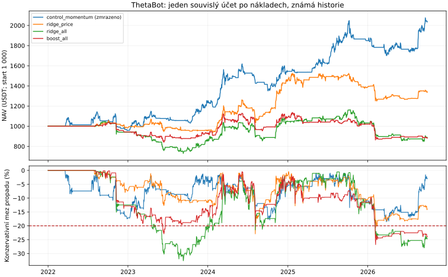

# ThetaBot: externí signály a pětidenní predikce

Porovnání posuzuje varianty proti **20% výzkumnému limitu propadu účtu** a přidává pět dní dopředu předpovídaný výnos, průběžně přeučovanou regresi, mělký boosting a kombinaci s momentum. Externí skupiny jsou přidávané odděleně: forex/akcie/volatilita/sazby/ropa, sentimentový index a funding/tok agresivních příkazů.

**Výběr zmrazený podle vývoje 2022–2024: `control_momentum`. Historický screening prošel.** Volba se po novějších výsledcích nemění. Krypto ceny, dřívější momentum volba i současný výběr tří přeživších aktiv už byly známé. Nové zdroje jsou dnešní historické snapshoty bez ověřených prvních zveřejnění: výsledky zůstávají výzkumnou diagnostikou.

**Výsledkem tohoto kola není zlepšení strategie:** výběr zůstal u dosavadního momentum. Žádná přidaná skupina neprokázala zlepšení predikční MSE v předem stanoveném testu. To je závěr o těchto konkrétních modelech a datech, nikoli tvrzení, že externí zdroje nikdy nemohou být užitečné.

## Výnos po simulovaných nákladech

| Varianta | 2025 | Leden–září 2026 | Souvislý účet 2022–2026 | Roční přepočet souvislé cesty | Konzervativní mez propadu | Všechny historické propady do 20 % |
|---|---:|---:|---:|---:|---:|:---:|
| control_momentum (zmrazeno) | +19.59% | +10.18% | +103.91% | +16.18% | -18.54% | ano |
| ridge_price | -5.82% | -3.93% | +34.14% | +6.38% | -22.91% | ne |
| ridge_macro | +0.99% | +6.86% | +28.66% | +5.45% | -22.85% | ne |
| ridge_sentiment | -6.69% | -7.57% | +7.73% | +1.58% | -23.34% | ne |
| ridge_crypto | -5.39% | -9.25% | +26.89% | +5.14% | -21.39% | ne |
| ridge_all | -1.35% | -14.00% | -11.19% | -2.47% | -32.63% | ne |
| boost_price | -8.04% | -8.30% | -7.25% | -1.57% | -26.68% | ne |
| boost_all | -6.92% | -13.39% | -11.56% | -2.55% | -26.79% | ne |
| blend_all | +1.14% | -5.85% | +25.39% | +4.88% | -24.63% | ne |

Roční tabulky používají nezávislé starty z 1 000 USDT. Souvislá cesta má jediný účet od začátku roku 2022 a neresetuje hotovost. Roční přepočet není předpověď. Intradenní mez sčítá maxima/minima držených aktiv, které nemusely nastat zároveň ani ve stejném pořadí; jde o konzervativní mez, nikoli přesně pozorovaný propad.

Zkrácení predikce na pět dní samo o sobě nezaručí rychlejší růst kapitálu. Cílem je zlepšit rozhodnutí a čistý výnos při stejném rozpočtu rizika; běžné přesuny portfolia zůstávají týdenní a výstupy či riziková snížení denní.

Sentimentový zdroj: **[Alternative.me Fear & Greed](https://alternative.me/crypto/fear-and-greed-index/)**. Jde o jejich Bitcoinový složený index, částečně postavený na ceně, objemu a volatilitě. Není to nezávislý NLP rozbor textu zpráv.



Graf předem stanovených cenových a úplných modelů ukazuje účinek algoritmu i externích dat v jedné nepřerušované cestě. Čárkovaná červená čára je 20% výzkumná hranice.

## Přidávají zdroje predikční informaci?

Stejný algoritmus se porovnává s cenovou variantou na společných dostupných datech roku 2025 až září 2026. Kladný rozdíl MSE znamená menší chybu po přidání skupiny. Interval vychází z 20denních bloků a z denního průměru ztráty napříč aktivy, takže nezapočítává silně korelovaná aktiva a překrývající se cíle jako nezávislé vzorky. 99% interval odpovídá přibližné korekci na pět porovnávaných přídavků.

| Přidaná skupina | Cenová reference | Společné dny | Průměrné zlepšení MSE | Blokový 99% interval | Interval celý nad nulou |
|---|---|---:|---:|---|:---:|
| ridge_macro | ridge_price | 633 | -0.00411 | [-0.00816, -0.00153] | ne |
| ridge_sentiment | ridge_price | 633 | -0.000388 | [-0.000774, -8.08e-05] | ne |
| ridge_crypto | ridge_price | 633 | -0.00476 | [-0.00809, -0.00218] | ne |
| ridge_all | ridge_price | 633 | -0.00953 | [-0.0141, -0.00603] | ne |
| boost_all | boost_price | 633 | -2.05e-05 | [-0.000482, +0.000439] | ne |

Nejde o důkaz ekonomické výhody. Výsledek blokového bootstrapu je přibližný a závisí na zvolené historii i stálosti trhu. Současná korelace s cenou ani snížení chyby predikce nezaručují obchodovatelný výnos po nákladech.

| Model | Párové predikce aktiv | MSE | MSE nulové predikce | Spearman IC |
|---|---:|---:|---:|---:|
| ridge_price | 1899 | 0.0048988 | 0.00395471 | -0.011 |
| ridge_macro | 1899 | 0.0090048 | 0.00395471 | +0.058 |
| ridge_sentiment | 1899 | 0.00528721 | 0.00395471 | -0.049 |
| ridge_crypto | 1899 | 0.00965583 | 0.00395471 | -0.040 |
| ridge_all | 1899 | 0.0144289 | 0.00395471 | -0.038 |
| boost_price | 1899 | 0.00494587 | 0.00395471 | -0.025 |
| boost_all | 1899 | 0.00496641 | 0.00395471 | -0.077 |

## Dvojnásobné náklady

| Varianta | 2025 | Leden–září 2026 | Souvislý výnos | Souvislá mez propadu |
|---|---:|---:|---:|---:|
| control_momentum | +17.80% | +8.68% | +88.24% | -19.24% |
| ridge_price | -7.65% | -5.27% | +23.78% | -23.23% |
| ridge_macro | -1.44% | +5.30% | +17.08% | -23.70% |
| ridge_sentiment | -8.87% | -8.90% | -1.22% | -25.51% |
| ridge_crypto | -7.92% | -10.10% | +15.46% | -23.33% |
| ridge_all | -3.63% | -15.12% | -18.34% | -33.58% |
| boost_price | -10.23% | -9.55% | -14.97% | -28.24% |
| boost_all | -8.52% | -14.15% | -18.23% | -28.11% |
| blend_all | -0.48% | -6.80% | +17.33% | -25.43% |

Běžný poplatek je 0,1 % při každém provedení, skluz 5 bps a plný spread 2 bps (jeho polovina při každém provedení). Stres zdvojnásobuje poplatek a skluz. Každý účet se znovu přehrává; jde o skutečné náklady realizovaných simulovaných příkazů.

## Dostupnost a kvalita zdrojů

| Řada | Záznamy zdroje | Dostupné rozhodovací dny | Dny s úplnými rysy |
|---|---:|---:|---:|
| DCOILWTICO | 1434 | 1734/1734 | 1714 |
| DGS10 | 1437 | 1734/1734 | 1714 |
| EURUSD | 1472 | 1734/1734 | 1714 |
| FEAR_GREED | 2098 | 1734/1734 | 1714 |
| FLOW_BNBUSDT | 1734 | 1734/1734 | 1695 |
| FLOW_BTCUSDT | 1734 | 1734/1734 | 1695 |
| FLOW_ETHUSDT | 1734 | 1734/1734 | 1695 |
| FUNDING_BNBUSDT | 1734 | 1734/1734 | 1695 |
| FUNDING_BTCUSDT | 1734 | 1734/1734 | 1695 |
| FUNDING_ETHUSDT | 1734 | 1734/1734 | 1695 |
| NASDAQCOM | 1442 | 1734/1734 | 1714 |
| USDJPY | 1472 | 1734/1734 | 1714 |
| VIXCLS | 1475 | 1734/1734 | 1714 |

ECB EUR/USD a USD/JPY: dostupnost v 18:00 UTC v den reference. NASDAQ, VIX a desetiletý výnos: dva americké federální pracovní dny; WTI: deset kalendářních dní. Index Alternative.me: jeden plný den po jeho timestampu. Spotový tok: po dokončení denní svíčky. Funding: po posledním započteném skutečném vypořádání plus pět minut. Join bere jen již dostupné záznamy a staré publikace expirují. Neznámá data se nedoplňují budoucí hodnotou.

**Vysoká datová nejistota: chybí první historická zveřejnění a původní verze FRED/ECB/Alternative dat.** Konzervativní zpoždění tuto nejistotu neodstraňuje. Časový join a prefixové testy ověřují naše zpracování snapshotu, nikoli historii všech oprav provedených poskytovatelem. Případné pozdější přínosy těchto řad proto potřebují potvrzení na archivovaných verzích nebo budoucích datech.

**Energetická hypotéza nebyla vyvrácena.** Energetickým vstupem v tomto kole byla ropa WTI uvnitř celé makro skupiny, nikoli samostatně testovaná cena elektřiny těžařů. [Cambridge mining report](https://www.jbs.cam.ac.uk/faculty-research/centres/alternative-finance/publications/cambridge-digital-mining-industry-report/) uvádí, že elektřina tvoří přes 80 % peněžních provozních nákladů dotázaných těžařů BTC; to dokládá nákladovou vazbu, nikoli automaticky předstih vůči ceně BTC. [EIA](https://www.eia.gov/electricity/wholesale/) popisuje i ERCOT North, ale v přímo stažených tabulkách elektřiny pro roky 2022 a 2026 tento hub **chybí**. Kontrola obsahu je v [záznamu zdrojové kontroly](THETABOT_ENERGY_SOURCE_CHECK_2026-10-06.json). [Přímý ERCOT report](https://www.ercot.com/mp/data-products/data-product-details?id=NP4-180-ER) uvádí historické ceny hubů s týdenní aktualizací. Časy historické veřejné publikace a původní verze se musí zvlášť ověřit: datum obchodu ani dodávky se nesmí zaměnit za čas dostupnosti tohoto datasetu. Tyto řady zatím nejsou zahrnuté do výsledků výše. Pro BTC je vhodnější samostatný energetický test; nelze přenášet stejný těžební mechanismus na celé portfolio. [Ethereum](https://ethereum.org/developers/docs/consensus-mechanisms/pos/pos-vs-pow) používá proof of stake s podstatně menší spotřebou elektřiny.

Binance archivní zdroje mají ověřené zveřejněné SHA-256 kontrolní součty. Nově stažené denní ceny a objemy pro tok příkazů se shodují s původními cenami backtestu. Funding sazby jsou jen signál: spotový účet je neplatí ani neinkasuje.

Skutečný historický NLP sentiment zpráv nebyl nahrazen indexem ani vymyšlen. Veřejná GDELT DOC historie nepokrývá celé trénovací období; první zkušební požadavek byl navíc omezen HTTP 429. ETF toky, open interest, on-chain likvidita a deduplikovaný zprávový korpus s prvním časem zachycení zůstávají dalšími hypotézami.

## Podmínky zmrazené varianty

| Podmínka | Výsledek |
|---|:---:|
| development_eligible | splněno |
| historical_risk_budget | splněno |
| later_net_positive | splněno |
| doubled_costs_positive | splněno |

Zmrazená varianta nepoužívá externí data, proto test dodatečné publikační latence neovlivňuje její rozhodnutí.

## Algoritmus a omezení

Regrese používá Ridge alpha=10 a scaler fitovaný jen na tréninku. Boosting má hloubku dvě, minimálně 30 vzorků v listu a pevné parametry. Každých dvacet dní se fituje posledních nejvýše 504 a nejméně 126 dokončených výsledků. Pět budoucích denních závěrů cíle musí být již známých. Klipování cíle na ±3 směrodatné odchylky používá jen trénink. Stávající dual Kalman/theta režimové rysy zůstávají součástí cenových vstupů.

Proměnlivé zpoždění reakce trhu je oddělené od dostupnosti publikace: každý externí rys má tři zpětná kalendářní okna 0–2, 3–9 a 10–20 dní. Jejich váhy se mohou měnit při přeučení; boosting může reagovat i na stav trhu. Trénink má exponenciální váhy s poločasem 126 dní, normalizované na průměr jedna. Vážený je scaler i regrese/boosting. Jde o hrubý model rozprostřené reakce, nikoli určení přesného zpoždění události či důkaz příčinnosti. Další Kalman ani EKF zde zatím nefiltruje váhy.

Modelové alokace mají nejvýše 100 % cílové expozice a 50 % na aktivum, škálované na cíl roční volatility 20 % podle celé kovariance. To není 20% zaručený maximální propad. Kontrola momentum zachovává 50%/25% strop. Týdenní pásmo 1 % NAV a minimum 10 USDT mohou ponechat zbytek pozice. Konečné pozice jsou oceněné trhem bez nucené likvidace. Likvidita, latence, daně a úročení hotovosti nejsou modelované. Živý bot se tímto experimentem nezapíná.

Všechny cesty mají zkontrolovanou nezápornou hotovost a pozice, NAV ze skutečných cen a náklady podle obchodů. Měsíční výsledky všech účtů a kompletní manifesty jsou v doprovodném JSON. [Pevný protokol](EXTERNAL_SIGNAL_RESEARCH_PLAN.md).

Zdroje: [ECB reference](https://www.ecb.europa.eu/stats/policy_and_exchange_rates/euro_reference_exchange_rates/html/index.en.html), [NASDAQ / FRED](https://fred.stlouisfed.org/series/NASDAQCOM), [CBOE VIX / FRED](https://fred.stlouisfed.org/series/VIXCLS), [US Treasury yield / FRED](https://fred.stlouisfed.org/series/DGS10), [EIA WTI / FRED](https://fred.stlouisfed.org/series/DCOILWTICO), [Alternative.me Fear & Greed](https://alternative.me/crypto/fear-and-greed-index/), [Binance](https://github.com/binance/binance-public-data).

## Opakování

```bash
python -m scripts.download_external_signals
OMP_NUM_THREADS=1 OPENBLAS_NUM_THREADS=1 python -m scripts.research_external_signals \
  --daily data/raw/*_1d_*.csv --report-out docs/evaluation
```
