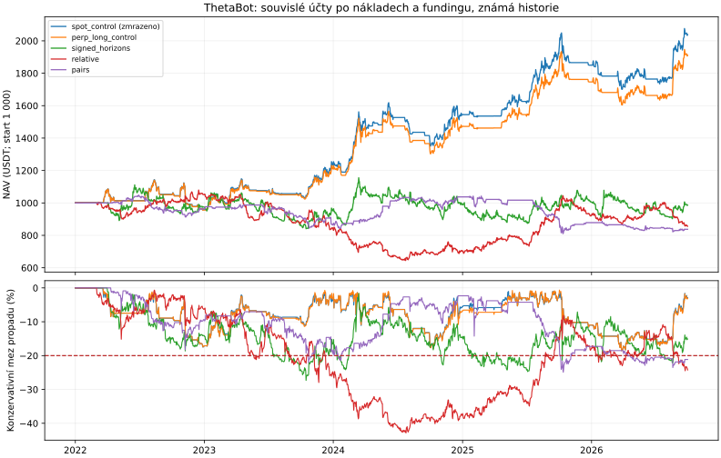

# ThetaBot: long/short, relativní obchody a skutečný funding

Dosavadní spot momentum přineslo +103,91 % za leden 2022 až září 2026 (16,18 % ročně) při konzervativní mezi propadu −18,54 %. To nesplňuje uživatelův cíl vysokého zisku. Toto kolo mění obchodní mechanismus: přidává shorty, několik trendových horizontů, EMA, průraz, relativní sílu, regresní páry a jejich pevnou kombinaci. **Výzkumný limit propadu zůstává 20 %.**

**Vývojový výběr 2022–2024: `spot_control`; úplný historický screening neprošel.** Volba je zapsaná před výpočtem novějších ekonomických výsledků. Novější období ani jiné pozdější vítěze nepoužíváme k jejímu přepnutí. Celá krypto historie i dnešní trojice přeživších aktiv už byly známé: toto není nový nezávislý holdout ani potvrzení budoucího zisku.

**Toto kolo nepřineslo potvrzené zlepšení zisku.** Vývojové pravidlo ponechalo dosavadní spotovou kontrolu; nové varianty nepřepínáme do bota jen podle příznivého jednotlivého období.

Souvislý čistý výnos zmrazené varianty: **+103.91%**, roční přepočet +16.18%, konzervativní mez propadu -18.54%. Rozdíl proti spotové kontrole je +0.00 procentního bodu.

## Výnos po poplatcích, cenovém dopadu a fundingu

| Varianta | 2025 | Leden–září 2026 | Souvisle 2025–září 2026 | Souvisle 2022–září 2026 | Roční přepočet celé cesty | Konzervativní mez propadu celé cesty |
|---|---:|---:|---:|---:|---:|---:|
| spot_control (zmrazeno) | +19.59% | +10.18% | +31.75% | +103.91% | +16.18% | -18.54% |
| perp_long_control | +18.25% | +9.43% | +29.33% | +91.15% | +14.61% | -18.60% |
| signed_m30 | +21.55% | +21.51% | +47.58% | +53.19% | +9.39% | -31.36% |
| signed_horizons | +1.17% | -1.95% | -0.85% | -1.38% | -0.29% | -27.33% |
| ema | +19.03% | +22.50% | +46.09% | +59.61% | +10.34% | -37.70% |
| breakout | -15.31% | +13.24% | -3.89% | -2.11% | -0.45% | -35.97% |
| relative | +30.39% | -7.04% | +21.29% | -14.39% | -3.22% | -42.82% |
| pairs | -15.25% | -4.69% | -19.18% | -16.25% | -3.66% | -24.92% |
| blend | +15.80% | +7.16% | +24.18% | +19.97% | +3.91% | -33.33% |

Samostatné roky mají čerstvý účet 1 000 USDT. Obě souvislé cesty mají jeden účet, žádný reset hotovosti, pozic ani maxima. Délka celé cesty je 1 734 dní, kratší souvislé cesty 638 dní. Roční přepočet je popis historie, nikoli odhad budoucího výnosu. Konečné pozice jsou oceněné trhem; náklady na nucené poslední uzavření nejsou účtované.

Spotová kontrola má denní OHLC meze; futures používají hodinové mark OHLC. Součty extrémů více aktiv nemusely nastat zároveň ani v pořadí maximum–minimum. Hranice je konzervativní mez, nikoli přesně naměřený intradenní propad. Kontrola `perp_long_control` používá stejný spotový signál a týdenní rozvrh, ale jiné provedení, mark ocenění a placený funding; izoluje změnu instrumentu.



## Vývoj a splnění rizikového rozpočtu

| Varianta | Vývojový čistý výnos 2022–2024 | Vývojová mez propadu | Celá cesta: denní závěry | Celá cesta: hodinová otevření/závěry | Všechny meze do 20 % včetně stresu | Všechny kolaterálové kontroly |
|---|---:|---:|---:|---:|:---:|:---:|
| spot_control | +54.33% | -17.89% | -16.98% | -17.05% | ano | ano |
| perp_long_control | +47.06% | -18.00% | -17.05% | -18.17% | ano | ano |
| signed_m30 | +3.52% | -31.03% | -29.09% | -31.02% | ne | ano |
| signed_horizons | -0.68% | -27.33% | -24.36% | -25.64% | ne | ano |
| ema | +9.29% | -37.70% | -36.17% | -37.19% | ne | ano |
| breakout | +1.80% | -35.97% | -35.48% | -35.76% | ne | ano |
| relative | -29.47% | -42.82% | -40.22% | -40.92% | ne | ano |
| pairs | +3.73% | -22.15% | -22.67% | -23.96% | ne | ano |
| blend | -3.48% | -33.33% | -31.46% | -32.62% | ne | ano |

Spotová pozorovaná metrika v pátém sloupci má pouze denní otevření a závěry. Požadavek 20 % se vyhodnocuje proti konzervativní mezi na každé cestě, včetně vývoje i dvojnásobných nákladů. Nižší roční cíl volatility není zárukou tohoto limitu.

## Dvojnásobný poplatek a skluz

| Varianta | 2025 | Leden–září 2026 | Souvisle 2025–2026 | Souvisle 2022–2026 | Mez propadu celé cesty |
|---|---:|---:|---:|---:|---:|
| spot_control | +17.80% | +8.68% | +27.82% | +88.24% | -19.24% |
| perp_long_control | +16.74% | +7.87% | +25.75% | +76.46% | -19.30% |
| signed_m30 | +12.32% | +13.07% | +26.56% | +4.64% | -39.34% |
| signed_horizons | -7.63% | -8.50% | -15.48% | -33.62% | -45.28% |
| ema | +15.99% | +20.00% | +39.52% | +39.65% | -40.14% |
| breakout | -19.31% | +9.36% | -11.34% | -19.42% | -44.18% |
| relative | +19.73% | -15.03% | +1.96% | -46.84% | -54.19% |
| pairs | -16.60% | -6.42% | -21.97% | -25.50% | -31.24% |
| blend | +9.73% | +2.31% | +12.40% | -9.26% | -39.36% |

Běžný simulovaný poplatek je 0,1 % z každého fillu, skluz 5 bps a plný spread 2 bps (polovina na fill). Stres zdvojnásobuje poplatek a skluz; spread a skutečné funding sazby zůstávají stejné. Náklady mění NAV a další velikosti příkazů, proto se všechny cesty přehrávají znovu.

## Náklady a kolaterál celé cesty

Hodnoty USDT níže se vztahují k jednomu souvislému účtu s počátečními 1 000 USDT. Kladný čistý funding znamená zaplacený náklad, záporný inkasovaný příjem.

| Varianta | Poplatky USDT | Skluz/spread USDT | Funding zaplacený USDT | Funding přijatý USDT | Čistý funding USDT | Obchody | Průměrná hrubá expozice |
|---|---:|---:|---:|---:|---:|---:|---:|
| spot_control | 73.85 | 44.31 | 0.00 | 0.00 | 0.00 | 432 | 23.47% |
| perp_long_control | 71.28 | 42.77 | 123.88 | 33.72 | 90.17 | 428 | 23.48% |
| signed_m30 | 284.97 | 170.98 | 149.97 | 95.00 | 54.97 | 1623 | 55.59% |
| signed_horizons | 262.64 | 157.58 | 116.33 | 62.65 | 53.68 | 2326 | 41.92% |
| ema | 96.61 | 57.97 | 144.57 | 93.36 | 51.21 | 1100 | 55.02% |
| breakout | 129.89 | 77.93 | 112.96 | 66.71 | 46.24 | 1190 | 42.83% |
| relative | 293.34 | 176.00 | 129.67 | 133.93 | -4.26 | 1719 | 72.13% |
| pairs | 72.15 | 43.29 | 84.76 | 57.85 | 26.91 | 889 | 36.73% |
| blend | 184.03 | 110.42 | 101.39 | 61.52 | 39.87 | 2435 | 38.33% |

| Futures varianta | Nejnižší konzervativní mez kolaterálu USDT | Nejvyšší hodinová hrubá expozice | Hodiny pod 5% margin mezí | Hodiny se zápornou mezí hotovosti |
|---|---:|---:|---:|---:|
| perp_long_control | 955.86 | 53.16% | 0 | 0 |
| signed_m30 | 893.96 | 112.38% | 0 | 0 |
| signed_horizons | 837.09 | 96.32% | 0 | 0 |
| ema | 785.59 | 111.32% | 0 | 0 |
| breakout | 815.81 | 112.76% | 0 | 0 |
| relative | 626.78 | 112.21% | 0 | 0 |
| pairs | 791.86 | 109.27% | 0 | 0 |
| blend | 818.90 | 70.38% | 0 | 0 |

Cílový hrubý notional je nejvýše 100 % NAV a absolutní aktivum 50 %. Cenové pohyby, náklady, minimum příkazu a denní rebalancování mohou skutečnou expozici mezi rozhodnutími zvýšit. 5% margin mez je předem zvolený výzkumný filtr, nikoli skutečný burzovní margin tier, stop-loss nebo simulace likvidace/ADL. Jakékoli porušení této meze či záporná kolaterálová hotovost variantu vyřazuje.

## Zmrazená volba: kontrolní podmínky

| Podmínka | Výsledek |
|---|:---:|
| development_eligible | splněno |
| historical_risk_budget | splněno |
| collateral_screen | splněno |
| separate_newer_years_positive | splněno |
| all_cost_stresses_positive | splněno |
| improves_continuous_later | nesplněno |
| improves_continuous_full | nesplněno |

## Zdroje a přesnost simulace

Futures mají 513 oficiálních měsíčních archivů s ověřeným SHA-256: 5 202 denních obchodních svíček, 124 848 hodinových mark svíček a 15 606 skutečných funding událostí. Každé aktivum pokrývá všech 1 734 dní. Časy fundingu včetně milisekundového jitteru a intervaly jsou zachované. Původní kontrolované spotové závěry slouží jen ke tvorbě signálů a kovariance.

Měsíční mark archivy měly 264 chybějících hodin v 11 dnech. Byly doplněné z odpovídajících oficiálních denních archivů s jejich vlastními kontrolními součty. Konečný hodinový grid je kompletní. Zdrojové soubory ani sazby se neinterpolují; seznam doplnění i hashe sestavených CSV jsou v doprovodném JSON.

Starší funding API neposkytuje mark cenu konkrétního vypořádání. Náklad proto oceňujeme konzervativně hodinovým mark high, příjem mark low. Při provedení ve stejné hodině se zvolí horší platba z původní a nové pozice. Binance negarantuje přesný okamžik vypořádání poblíž funding timestampu. Tato aproximace může výnos podhodnotit; nejde o přesný tickový funding. Souběžné příjmy a platby různých aktiv se v intradenní mezi započítají i přes možné mezilehlé kolaterálové zůstatky, nikoli pouze jejich čistý součet.

Nové denní příkazy využívají předchozí dokončený spotový závěr a kovarianci z 60 uzavřených denních výnosů, staženou o 25 % k diagonále. Cíl roční volatility je 20 %, pouze snižuje velikost. Pásmo rebalancování je 1 % NAV, minimum 10 USDT. Mimo pásmo probíhají výstupy a omezení rizika či stropů. Shorty mají podepsanou zásobu a průměrnou vstupní cenu; cash se mění pouze realizovaným P&L, poplatkem a fundingem, NAV přidává unrealized mark P&L.

**Všech 81 cest je účetně zkontrolovaných:** pozice proti podepsaným fillům, kolaterál proti realizaci/poplatkům/fundingu, NAV proti hodinovým mark závěrům a navíc nezávislá identita podepsaných obchodních cashflow plus konečná hodnota zásoby. Skluz není podruhé odečítaný od NAV. Regresní testy ověřují účetnictví long/short, převrácení pozice, funding jitter, časovou kauzalitu a odmítnutí mezer.

Simulace neověřuje skutečnou hloubku trhu, latenci, burzovní zaokrouhlení množství, úročení kolaterálu, daně ani budoucí stálost vztahů. Nové strategie nejsou zapnuté pro živé obchodování.

[Předem zapsaný protokol](LONG_SHORT_RESEARCH_PLAN.md). Zdroje: [Binance public archives](https://github.com/binance/binance-public-data), [funding a okamžik vypořádání](https://www.binance.com/en/support/faq/detail/360033525031), [mark cena](https://www.binance.com/en/support/faq/detail/360033525071), [historický výzkum krypto momentum](https://www.nber.org/papers/w24877). Tyto zdroje nepotvrzují výdělečnost zdejší implementace.

## Opakování

```bash
python -m scripts.download_futures_research
OMP_NUM_THREADS=1 OPENBLAS_NUM_THREADS=1 python -m scripts.research_long_short \
  --daily data/raw/*_1d_*.csv --report-out docs/evaluation
```
