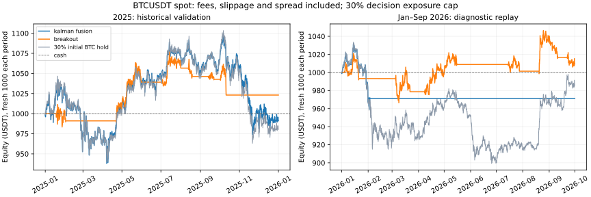

# ThetaBot: více přístupů a Kalmanova fúze — 6. října 2026

**Kalmanova fúze je implementovaná, ale ekonomicky neprošla.** Výběr podle let
2022–2024 zvolil `kalman_fusion`: v roce 2025 pak dosáhl výnosu -0.87 %,
za leden–září 2026 -2.86 %. Nejlepší pozorovaný výsledek
v roce 2025 měl `breakout` (+2,31 %), který byl kladný i v diagnostice 2026
(+0,94 %). Tento výběr podle porovnání je průzkumný, ne nový nezávislý důkaz.
Nasazení vítěze vývojového vzorku by ztrácelo peníze; žádný živý obchod nebyl
proveden ani aktivován. Cíl je nejvyšší čistý zisk v uvedeném souboru kandidátů,
za stejného kapitálu a limitu expozice.

## Je původních +0,82 % po poplatcích?

Ano. Původní oddělený test z července–září 2026 počítal 0,1 % poplatek za
každé provedení, 5 bp skluz u tržního plnění a 2 bp plný spread. Z 1000 USDT
bylo +8,20 USDT čistého; aritmetický hrubý výsledek na stejných obchodech
11,86 USDT, poplatky 2,58 USDT, skluz/spread 1,09 USDT. Průměrná expozice
byla pouze 4,56 %. Hrubý výsledek není samostatný běh bez nákladů. Limitní
plnění má vlastní předpoklady a nedostává ještě dodatečný tržní skluz.

Rozšířené porovnání níže používá jiná časová období a dovoluje skutečný výstup
ze ztrátové pozice. Původní profit guard takový výstup mohl blokovat. Nové
výsledky proto nejsou přímou změnou stejného původního testu.

## Stejné podmínky pro všech 11 kandidátů

BTCUSDT spot, 1h, 1000 USDT, 30% cílová expozice vynucená při rozhodování,
bez páky, poplatek 0,1 % za provedení, tržní skluz 0,05 %, plný spread
0,02 %. Stres zdvojnásobuje poplatek i skluz a znovu počítá rozhodnutí; spread
zůstává stejný. Jiné náklady mohou změnit obchody, takže horší jednotlivá
plnění nemusí znamenat monotónně horší souhrnný výnos.

57 měsíčních archivů má ověřené SHA-256 součty. Celkem 41,615
svíček, leden 2022–září 2026. Chybí jedna zdrojová hodina, 24. března 2023
13:00 UTC; zůstává chybějící a nebyla nahrazena umělou svíčkou.

Výběr proběhl podle maximálního čistého výnosu na vývoji, s kladným výsledkem
a maximálním propadem do 15 %. Volba byla uložená před následným porovnáním.
Rok 2025 je historické ověření v rámci společného průzkumu; po předchozím
experimentu se škálou filtru není označen jako nový potvrzující lockbox.
Rok 2026 byl zčásti dříve viděný a je diagnostika. Parametry se po ověření
neladily. Výsledky jsou konečné tržní ocenění otevřených pozic bez likvidace.

| Přístup | Vývoj 2022–2024 | Rok 2025 | 2025 dvojí náklady | 2026 leden–září | Max. propad 2025 | Provedení 2025 |
|---|---:|---:|---:|---:|---:|---:|
| legacy_theta | -32.90 % | -15.28 % | -27.13 % | -9.38 % | -15.44 % | 2162 |
| log_vol_theta | -89.98 % | -63.23 % | -86.47 % | -45.15 % | -63.47 % | 3433 |
| log_vol_no_conf | -88.58 % | -62.58 % | -85.55 % | -42.91 % | -62.82 % | 3004 |
| momentum | +43.59 % | +1.28 % | +1.18 % | -0.65 % | -6.10 % | 51 |
| ema_trend | +25.86 % | +1.51 % | +0.95 % | +0.27 % | -6.40 % | 27 |
| breakout | +22.57 % | +2.31 % | +1.57 % | +0.94 % | -4.97 % | 29 |
| range_reversion | -1.40 % | -0.42 % | -0.60 % | -1.97 % | -3.32 % | 11 |
| ensemble_equal | +18.53 % | -1.47 % | -2.28 % | -1.11 % | -4.47 % | 180 |
| ensemble_regime | +22.33 % | -1.59 % | -3.08 % | -1.07 % | -4.96 % | 180 |
| forecast_mean | +46.40 % | -4.50 % | -1.84 % | +1.59 % | -13.78 % | 37 |
| kalman_fusion | +48.40 % | -0.87 % | -0.54 % | -2.86 % | -11.27 % | 31 |

Počáteční 30% nákup a držení BTC: rok 2025
-1.95 %,
leden–září 2026 -1.42 %.
To je srovnání výnosu kapitálu; expozice/riziko nejsou plně vyrovnané.



## Jak funguje fúze

Theta a čtyři cenové přístupy nejprve vytvářejí skóre. Každé se kalibruje na
očekávaný výnos příštího dokončeného UTC dne pomocí již známých výsledků,
nejvýše 252 dní a nejméně 126 pozorování. Nejnovější učící dvojice je včerejší
skóre a dnes známý výnos. Současná nebo budoucí odpověď pro dnešní skóre se
při kalibraci nepoužívá.

Kalmanův stav je očekávaný denní výnos. Kovariance měření vychází z dříve
realizovaných chyb jednotlivých předpovědí a zahrnuje jejich korelaci; dva
podobné signály tedy nepředstavují dvě nezávislá potvrzení. Parametry Q/R
jsou předem určené v protokolu. Josephův přepočet zachovává kladnou varianci.
Model je lineární, proto zde není potřeba EKF ani jeho nelineární Jacobian.
Všechny zdroje sdílejí jednu výslednou pozici a jednu cestu provedení.

Fúze měla na 365 denních předpovědích
úspěšnost směru 50.14 %.
Střední čtvercová chyba byla 0.000474906,
pro předpověď nulového výnosu 0.000474831.
Složitější kombinace tedy nepřinesla lepší předpověď než tento jednoduchý
referenční model. Kvartály 2025 s nezávisle obnoveným kapitálem dopadly
-3.57 %, +8.14 %, +1.87 %, -6.81 %. Vývojový zisk
+48.40 % sám o sobě nebyl přenositelný.

## Co je v kódu a co z toho plyne

- Osm nových režimů strategie lze zvolit přes `spot_bot.run_live --strategy`:
  momentum, EMA trend, breakout, range reversion, dvě expozicové kombinace,
  průměr kalibrovaných předpovědí a Kalmanova fúze. Výchozí režim se neaktivoval.
- Volitelný logaritmický dual Kalman je invariantní vůči jednotkám ceny a
  normalizuje inovaci minulou volatilitou. Správná kalibrace automaticky
  nevytváří obchodní výhodu; přímé časté obchodování v tomto testu ztrácí.
- Nové strategie mohou provést ztrátový výstup a snížit pozici nad rizikový
  limit. Hysteréze ani požadavek zisku tyto redukce nezablokují.
- Dokončený den se nikdy nepřenáší zpět do nedokončených hodin. Regresní
  testy kontrolují budoucí data, společný horizont, korelované předpovědi,
  stejný výsledek jednotlivého a dávkového signálu a účetnictví paper režimu.
- 403 regresních testů a 8 testů metrik prošlo lokálně. Stav GitHub CI po
  publikaci je v PR #119; JSON zachycuje stav vytvoření artefaktu.

Pro další paper průzkum je `breakout` zajímavější než okamžité nasazení fúze.
Je to výběr po tomto porovnání, který stále potřebuje nové pozorování. Cíl
velkého stabilního zisku zatím doložený není. Fúzní API zůstává připravené
pro další zdroje předpovědí; jejich užitečnost se musí měřit stejně.

## Opakování

```bash
python -m scripts.download_binance_archive --allow-gaps --start-month 2022-01 --end-month 2023-12 --out data/raw/BTCUSDT_1h_2022_2023.csv
python -m scripts.download_binance_archive --start-month 2024-01 --end-month 2025-12 --out data/raw/BTCUSDT_1h_2024_2025.csv
python -m scripts.download_binance_archive --start-month 2026-01 --end-month 2026-09 --out data/raw/BTCUSDT_1h_2026_01_09.csv
python -m scripts.research_multi_strategy --csv data/raw/BTCUSDT_1h_2022_2023.csv data/raw/BTCUSDT_1h_2024_2025.csv data/raw/BTCUSDT_1h_2026_01_09.csv --as-of 2026-10-06T09:45:00Z --out artifacts/multi_strategy_capped
python -m scripts.write_multi_research_report --summary artifacts/multi_strategy_capped/summary.json --csv data/raw/BTCUSDT_1h_2022_2023.csv data/raw/BTCUSDT_1h_2024_2025.csv data/raw/BTCUSDT_1h_2026_01_09.csv
```

Přesné definice, zdroje a omezení:
[předem napsaný protokol](MULTI_STRATEGY_RESEARCH_PLAN.md),
[úplné měření a kontrolní součty](THETABOT_MULTI_2026-10-06.json).
Kalmanovy rovnice odpovídají
[autorské dokumentaci](https://filterpy.readthedocs.io/en/latest/kalman/KalmanFilter.html);
převod indikátorů na výnosy a jeho nastavení jsou naše výzkumné volby.
Paper běh potřebuje dostatečnou historii pro denní kalibraci, například
10 000 hodinových svíček; kratší historie u fúze zůstane v hotovosti.
Živá latence, fronty objednávek a obnovení celého procesu nejsou tímto testem
ověřené.
